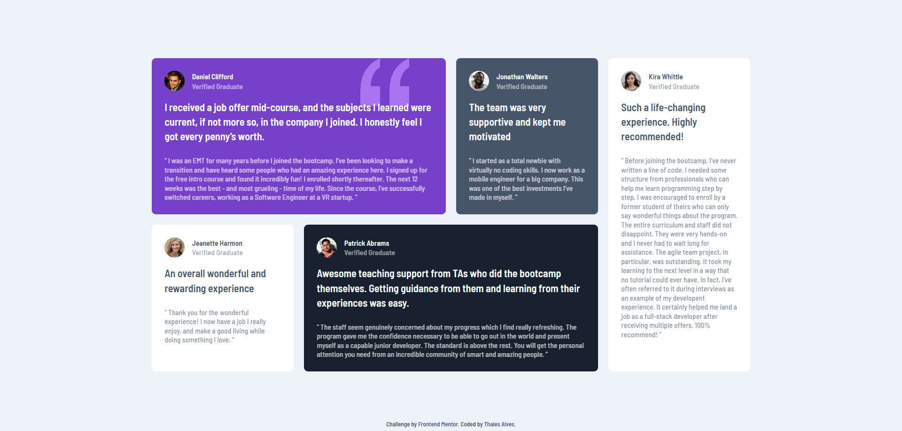
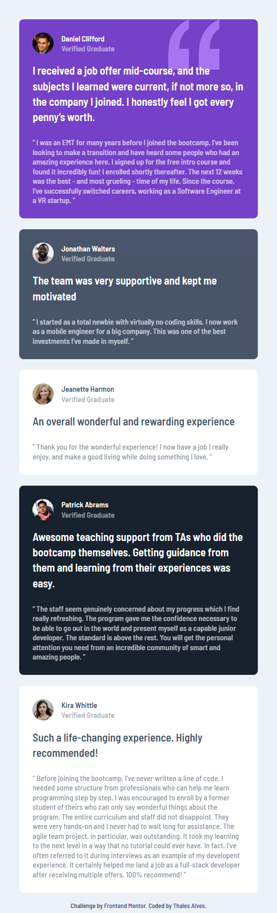

# Frontend Mentor - Testimonials grid section

This is a solution to the [Testimonials grid section challenge on Frontend Mentor](https://www.frontendmentor.io/challenges/testimonials-grid-section-Nnw6J7Un7). Frontend Mentor challenges help you improve your coding skills by building realistic projects. 

## Table of contents

- [Overview](#overview)
  - [The challenge](#the-challenge)
  - [Screenshot](#screenshot)
    - [Desktop Layout](#desktop-layout)
    - [Mobile Layout](#mobile-layout)
  - [Links](#links)
- [My process](#my-process)
  - [Built with](#built-with)
  - [Useful resources](#useful-resources)
- [Author](#author)

## Overview

### The challenge

Users should be able to:

- View the optimal layout for the site depending on their device's screen size

### Screenshot

#### Desktop Layout

#### Mobile Layout

### Links

- Live Site URL: [Testimonials grid section](https://testimonials-grid-section-lilac-xi.vercel.app/)

## My process

### Built with

- Semantic HTML5 markup
- Flexbox
- CSS Grid
- Sass/Scss

### Useful resources

- [Sass documentation](https://sass-lang.com/) - Official Sass documentation

## Author

- Frontend Mentor - [@thalesAlves758](https://www.frontendmentor.io/profile/thalesAlves758)
- GitHub - [@thalesAlves758](https://github.com/thalesAlves758)
